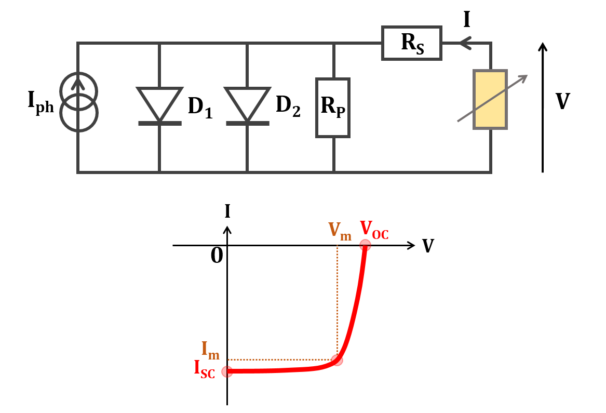
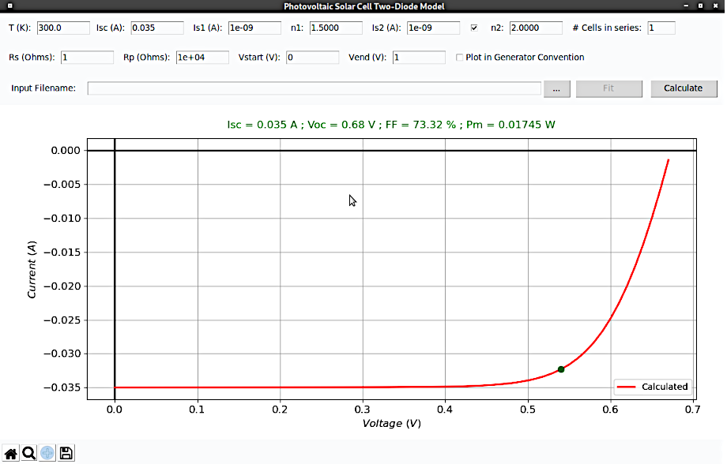

# Photovoltaic Solar Cell Two-Diode Model

Code written by:  
Sidi Hamady  
Dr. habil. Eng., Associate professor  
Université de Lorraine, France  
sidi.hamady@univ-lorraine.fr

See Copyright Notice in COPYRIGHT

## Presentation and Requirements

Photovoltaic-Model calculates the current-voltage characteristic of a solar cell using the two-diode model, with a possibility to fit an experimental characteristic to get short-circuit current, diodes parameters (reverse saturation current and ideality factor), series and parallel resistances.




To install Photovoltaic-Model:  
just download it:  
from github: [https://github.com/sidihamady/Photovoltaic-Model](https://github.com/sidihamady/Photovoltaic-Model)  
or from my website: [http://www.hamady.org/photovoltaics/PhotovoltaicModel.zip](http://www.hamady.org/photovoltaics/PhotovoltaicModel.zip)  
unzip and use.

The distribution mainly includes:  

Two main Python files:  
* [PhotovoltaicModelCore.py](PhotovoltaicModelCore.py) implementing the program core functionality in the module classes, with a simple and easy-to-use graphical user interface.  
* [PhotovoltaicModel.py](PhotovoltaicModel.py) implementing the program interface.  


It is not necessary to know the Python language to use the program.

The basic requirements are found in any Linux distribution (and easily installed for Windows):
* Python version 2.7.x or later
* numpy version 1.5 or later
* scipy version 0.13.1 or later
* matplotlib version 1.3.x or later
* tkinter 8.5 or later

PS: for Windows, you can download a complete Python distribution from [https://www.anaconda.com/distribution/](https://www.anaconda.com/distribution/)

## HowTo

Start [PhotovoltaicModel.py](PhotovoltaicModel.py) interface:  

from the command line prompt:  
under Linux:
```
cd /path/to/PhotovoltaicModel/  
python -u PhotovoltaicModel.py  
```
under Windows (in the command prompt):
```
cd C:\path\to\PhotovoltaicModel\  
python.exe -u PhotovoltaicModel.py  
```
You have to add python to your PATH.  

You can also execute [PhotovoltaicModel.py](PhotovoltaicModel.py) by double clicking on it (depending on the operating system settings), or from within your editor, if possible.

In the graphical interface, change the parameters you want and press 'Calculate'.  



To fit experimental current-voltage characteristic, load the file and press 'Fit'.  
The file format consists of two columns (voltage in V  and current in A) separated by tabulation:  
0.00	-20.035e-3  
0.05	-20.035e-3  
...  
0.55	-1.5e-8  
The first two lines and lines beginning with a hash are ignored.
